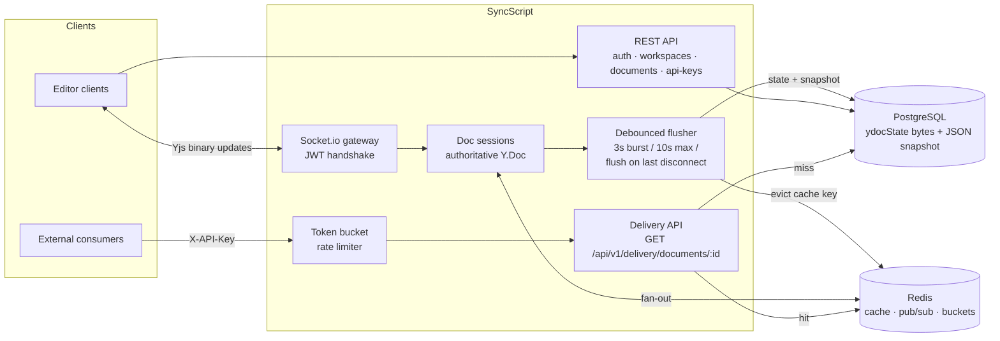
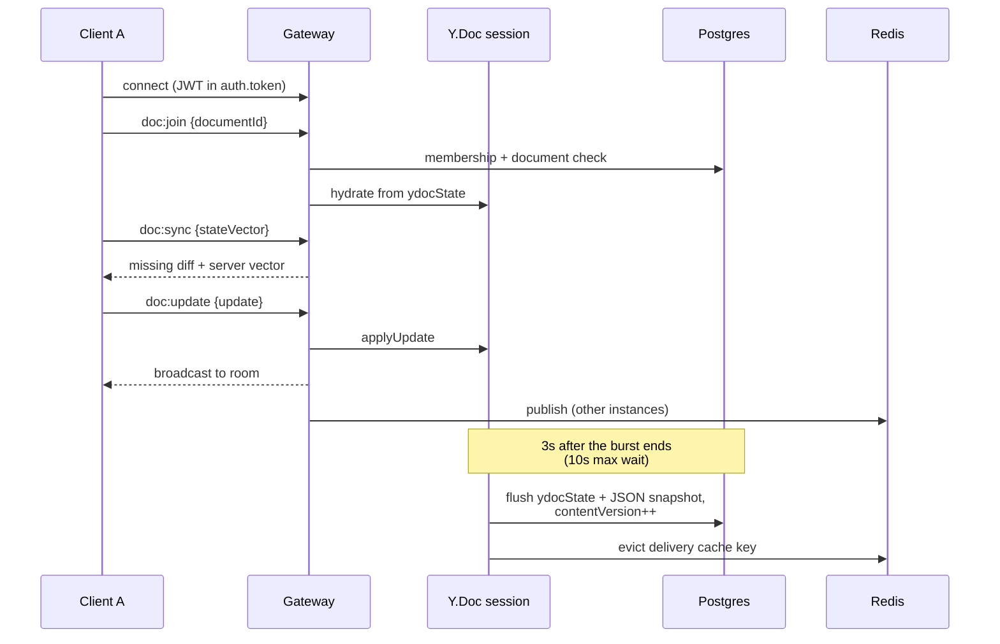

# SyncScript

**Headless CMS & collaborative workspace engine** — an API-first, developer-focused alternative to Notion. Multi-tenant workspaces, infinitely nested documents, conflict-free realtime co-editing over CRDTs, and a cached public delivery API for external consumers.

[](https://github.com/poethy/SyncScript/actions/workflows/ci.yml)

## Highlights

- **Type-safe end to end** — TypeScript strict mode, Zod-validated routes *and* environment, Prisma-generated database types
- **Relational multi-tenancy** — workspaces with ranked RBAC (`OWNER > EDITOR > VIEWER`), documents nesting to arbitrary depth via a self-relation, sub-trees resolved with a single recursive CTE
- **Conflict-free realtime editing** — Yjs CRDTs over Socket.io: JWT handshake, per-document rooms, state-vector sync, and Redis pub/sub fan-out across server instances
- **Write-saturation protection** — edits live in memory and flush to Postgres debounced (3s after a burst, 10s max wait, immediately when the last client leaves)
- **Developer platform** — SHA-256-hashed API keys (workspace-wide or scoped to a document sub-tree), Redis-cached delivery endpoint with flush-driven invalidation, atomic token-bucket rate limiting in Lua

## Architecture



### Realtime sync flow



### Key design decisions

| Decision | Why |
| --- | --- |
| CRDT source of truth is the **binary Yjs state** (`ydocState BYTEA`); the JSON snapshot (`content JSONB`) is derived on flush | Storing only JSON would destroy conflict-free merging; consumers still get clean JSON |
| API keys stored as **SHA-256 hashes** with an identifying prefix | A database leak alone cannot be replayed against the delivery API |
| Workspace ownership is **only** `WorkspaceMembership.role = OWNER` | One source of truth for RBAC — no parallel `ownerId` column to disagree with |
| Non-members receive **404, not 403** | Resource existence is never leaked across tenant boundaries |
| Refresh tokens are opaque, hashed, and **rotation detects reuse** | A replayed rotated token revokes the whole session family |
| Cache lives in shared Redis; the **flusher drives eviction** | Most writes originate in the realtime layer, and one eviction covers every instance |
| Rate limiting is a **Lua token bucket** in Redis | Atomic read-refill-consume across instances; fails open if Redis is down |

## API surface

| Area | Endpoints |
| --- | --- |
| Auth | `POST /api/v1/auth/register · login · refresh · logout`, `GET /me` |
| Workspaces | CRUD on `/api/v1/workspaces`, members under `/:workspaceId/members` |
| Documents | CRUD + tree on `/api/v1/workspaces/:workspaceId/documents`, `GET /:documentId/subtree` |
| API keys | `/api/v1/workspaces/:workspaceId/api-keys` (create returns the secret once) |
| Delivery (public) | `GET /api/v1/delivery/documents/:id` with `X-API-Key` |
| Realtime | Socket.io: `doc:join · doc:leave · doc:sync · doc:update`, `doc:presence` |

## Getting started

```bash
docker compose up -d        # postgres:16 + redis:7
cp .env.example .env
npm install
npm run db:migrate
npm run dev                 # http://localhost:3000/healthz
```

| Script | Purpose |
| --- | --- |
| `npm run dev` | Dev server with watch |
| `npm test` | Unit + integration (integration self-skips without Postgres/Redis) |
| `npm run lint` / `typecheck` / `build` | Quality gates (same as CI) |
| `npm run db:migrate` / `db:studio` | Prisma migrations / data browser |

Environment variables are validated at boot (`src/config/env.ts`); see [.env.example](.env.example).

## Project layout

```
prisma/                  schema, migrations
src/
  config/                zod-validated environment
  lib/                   prisma client, redis clients, logger
  middlewares/           authenticate · rbac · apiKeyAuth · rateLimiter · errorHandler
  modules/               auth · workspaces · documents · api-keys · delivery
  realtime/              gateway · protocol · docSession · persistence · pubsub
tests/                   unit + integration (vitest)
```

See [ROADMAP.md](ROADMAP.md) for the phased build plan this repository follows.
