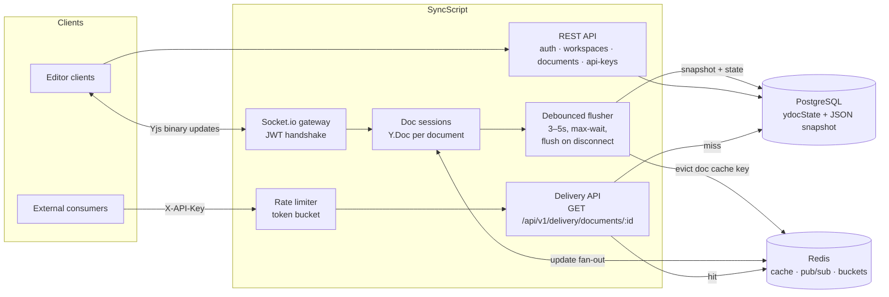

# SyncScript — Architecture & Development Roadmap

SyncScript is a headless CMS and collaborative workspace engine: an API-first,
developer-focused alternative to Notion. It demonstrates type-safe relational
modeling (PostgreSQL + Prisma), conflict-free realtime co-editing (Yjs CRDTs
over Socket.io), and a high-performance public delivery API (Redis caching +
token-bucket rate limiting) on Fastify + TypeScript.

## System overview



### Key design decisions

- **CRDT source of truth is binary.** `Document.ydocState` stores the encoded
  Yjs update; `Document.content` is a derived JSON snapshot written on each
  flush and served by the Delivery API. Storing only JSON would destroy
  conflict-free merging.
- **Debounced persistence.** Edits live in memory and fan out over WebSockets;
  a per-document flusher writes to Postgres every 3–5 seconds with a max-wait
  bound, and flushes immediately when the last client disconnects — bounding
  both write load and crash-loss.
- **Flush-driven cache invalidation.** The flusher (where nearly all document
  writes originate) evicts the document's Redis cache key and publishes the
  eviction over pub/sub so every instance stays consistent.
- **Hashed API keys.** Only a SHA-256 hash is stored (`ApiKey.keyHash`); the
  raw key is shown once. `prefix` enables dashboard identification. Keys scope
  to a whole workspace or to a document sub-tree (resolved via recursive CTE,
  cached in Redis).
- **Single source of truth for ownership.** Workspace ownership is expressed
  only as `WorkspaceMembership.role = OWNER` — no parallel `ownerId` column
  for RBAC checks to disagree with.

## Commit roadmap (Conventional Commits)

### Phase 0 — Foundation ✅
1. `chore: scaffold typescript project with tooling and docker compose`
2. `feat(db): add prisma schema for users, workspaces, documents and api keys`
3. `feat(core): bootstrap fastify app with env validation, logging and health check`
4. `docs: add architecture roadmap`

### Phase 1 — Auth & Tenancy ✅
5. `feat(auth): user registration and login with argon2 and jwt`
6. `feat(auth): refresh token rotation and authenticate middleware`
7. `feat(workspaces): workspace crud with membership management`
8. `feat(workspaces): role-based access control middleware`

### Phase 2 — Documents
9. `feat(documents): nested document crud with tree queries`
10. `feat(documents): sub-tree resolution via recursive cte`

### Phase 3 — Realtime
11. `feat(realtime): socket.io gateway with jwt handshake and document rooms`
12. `feat(realtime): yjs crdt sync protocol over socket.io`
13. `feat(realtime): debounced postgres persistence with snapshot derivation`
14. `feat(realtime): redis pub/sub for multi-instance update fan-out`

### Phase 4 — Developer Platform
15. `feat(api-keys): scoped api key management with hashed storage`
16. `feat(delivery): public document delivery endpoint with api key auth`
17. `feat(delivery): redis caching with flush-driven invalidation`
18. `feat(delivery): token bucket rate limiting via redis lua script`

### Phase 5 — Hardening
19. `test: integration test suite for auth, rbac and delivery`
20. `ci: add github actions workflow for lint, typecheck and tests`
21. `docs: comprehensive readme with architecture diagrams`

## Project layout

```
prisma/                  schema, migrations, seed
src/
  config/env.ts          zod-validated environment
  lib/                   prisma client, redis clients, logger
  middlewares/           errorHandler · authenticate · rbac · apiKeyAuth · rateLimiter
  modules/               one folder per domain (routes/controller/service/schemas):
                         auth · workspaces · documents · api-keys · delivery
  realtime/              gateway · docSession · persistence (debounced flusher)
  app.ts                 fastify app factory
  server.ts              bootstrap (http + socket.io)
tests/                   vitest (unit + integration)
```

Module folders are created as their phase lands — only code that compiles and
runs is checked in.

## Local development

```bash
docker compose up -d        # postgres:16 + redis:7
cp .env.example .env
npm install
npm run db:migrate          # applies prisma/migrations
npm run dev                 # http://localhost:3000/healthz
```

`npm run lint` · `npm run typecheck` · `npm test` · `npm run build`
